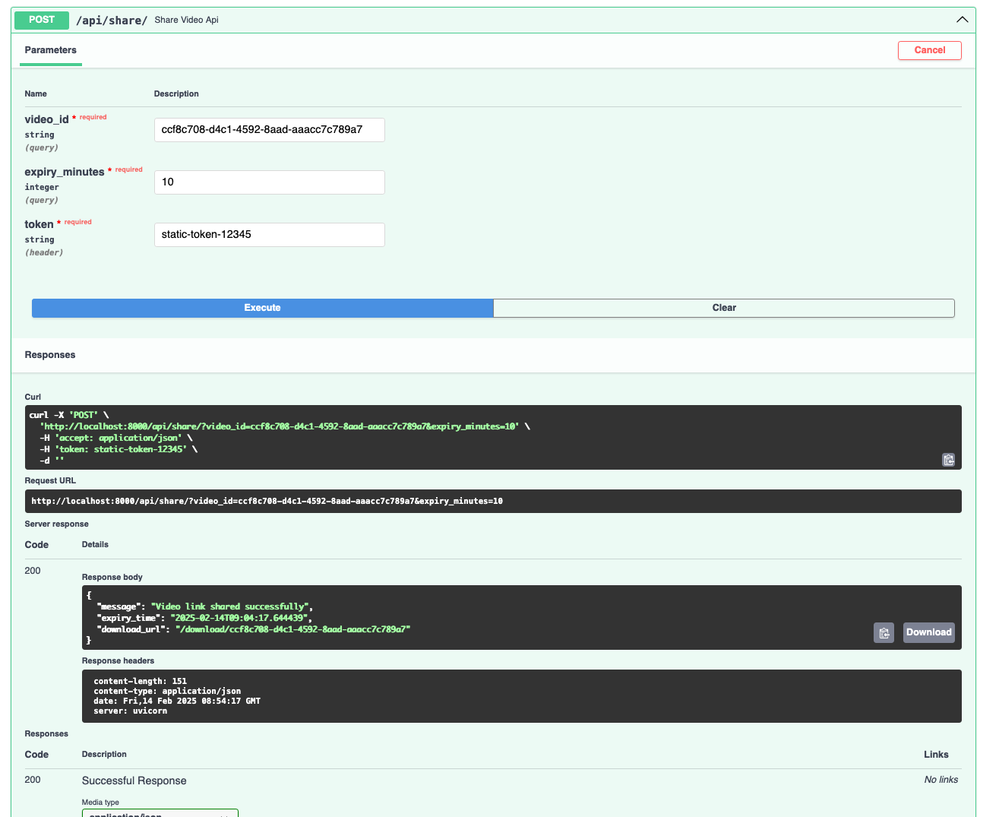

# Videoverse Video Processing API
🚀 This API allows users to **upload, trim, merge, share, and download videos** using **FastAPI** and **FFmpeg**.

## 📌 Features
✅ **Upload videos** with size and duration limits  
✅ **Trim videos** using timestamps (`HH:MM:SS`)  
✅ **Merge multiple videos** into a single file  
✅ **Share video links with expiration**  
✅ **Download processed videos**  

---

## 🔧 Installation & Setup
### **1️⃣ Install Dependencies**
```sh
pip install -r requirements.txt
```

### **2️⃣ Run the API Server**
```sh
uvicorn app.main:app --reload
```

### **3️⃣ Swagger Documentation**
Visit the API documentation at:
```
http://localhost:8000/docs
```
Note: Entry Point of application: main.py (FAST API)
---

## 📖 API Endpoints

### **Upload a Video**
**Endpoint:** `POST /api/upload/`  
```sh
curl -X 'POST' \
  'http://localhost:8000/api/upload/?max_size_mb=25' \
  -H 'accept: application/json' \
  -H 'token: static-token-12345' \
  -H 'Content-Type: multipart/form-data' \
  -F 'file=@4074364-hd_1280_720_25fps.mp4;type=video/mp4'
```

### **Trim a Video**
**Endpoint:** `POST /api/trim/`  
```sh
curl -X 'POST' \
  'http://localhost:8000/api/trim/?video_id=1081e0e7-8dec-4aae-bc8a-146c3495b8ab&start_time=00%3A00%3A02&end_time=00%3A00%3A13' \
  -H 'accept: application/json' \
  -H 'token: static-token-12345' \
  -d ''
```

### **Merge Multiple Videos**
**Endpoint:** `POST /api/merge/`  
```sh
curl -X 'POST' \
  'http://localhost:8000/api/merge/' \
  -H 'accept: application/json' \
  -H 'token: static-token-12345' \
  -H 'Content-Type: application/json' \
  -d '{
  "video_ids": [
    "1081e0e7-8dec-4aae-bc8a-146c3495b8ab",
    "b4d1e84a-e0d7-4c1f-a9d5-1fb05b204f04"
  ]
}'
```

### **Share a Video**
**Endpoint:** `POST /api/share/`  
```sh
curl -X 'POST' \
  'http://localhost:8000/api/share/?video_id=b4d1e84a-e0d7-4c1f-a9d5-1fb05b204f04&expiry_minutes=5' \
  -H 'accept: application/json' \
  -H 'token: static-token-12345' \
  -d ''
```

### **Download a Video**
**Endpoint:** `GET /api/download/{video_id}`  
```sh
curl -X 'GET' \
  'http://localhost:8000/api/download/b4d1e84a-e0d7-4c1f-a9d5-1fb05b204f04' \
  -H 'accept: application/json'
```

---

## 📸 Screenshots

**Upload API**


**Trim API**


**Merge API**


**Share API**



**Download API**


---

## 🛠️ Running Tests
Run the test suite with:
```sh
pytest --cov=app --cov-report=html
```

---

## 📝 Notes
- **Authentication:** Requires `token` in headers.
- **FFmpeg Required:** Ensure FFmpeg is installed on the system.
- **File Limits:** Supports files up to `25MB`, trim duration `5s-25s`.

---

## 📌 Author
👤 **Naman Vats**  
📧 **way2naman13@gmail.com**  
📍 **GitHub:** [Your Repo](https://github.com/your-repo)

## 📖 References
- https://www.ffmpeg.org/
- https://github.com/FFmpeg/FFmpeg
- https://docs.pydantic.dev/latest/
- https://fastapi.tiangolo.com/